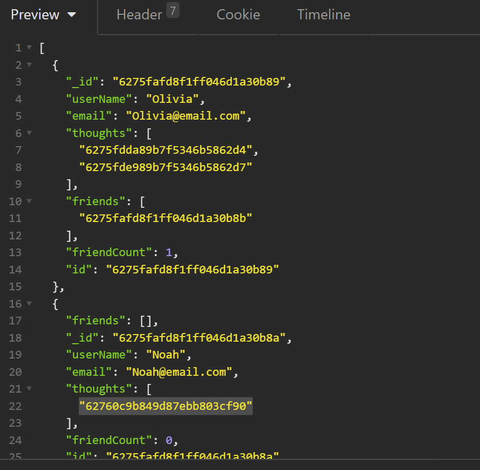

# DU-HW18-Social-Network-API

DU Coding Bootcamp Homework 18: NoSQL: Social Network API

# node.js application with SQL (MongoDB) connectivity
This is a node.js script using **express** relying on NPM package **mongoose** to access a MongoDB server as defined by the connection in the /config/connection.js and environment variables (.env) using **dotenv**.

Github Repository Address: 

## Live App
See live deployed app at 
>**Heroku**: This site is currently live on Heroku using **MongoDB Atlas**.

## Purpose

This application is specific to anyone that wants to view and post items to a MongoDB database via API.

## THE FOLLOWING CONTENT IS UNDER CONTSTRUCTION
## --------------------------------------------

## Instructions for GitHub developer use
1. Ensure you have downloaded and installed node.js and have rebooted your system (if Windows)
2. Clone repository to your system.
3. From a terminal, ensure you are in the server.js directory
4. Update the /config/connection.js to include your database connection info as well as your envrionment variables (.env).
5. Within a mysql CLI, run the ./db/schema.sql
6. Run:
~~~
npm i
npm run seed
npm start
~~~

## Audience

The intended audience is an individual that would like to use a Tech Blog.

&#x2612; **USER** Technical Knowledge:
The user of this site does **_not_** need to have a technical background.

&#x2611; **Developer** Technical Knowledge:
A developer editing this code does need to have a technical background, and *should* understand node.js, express, and MYSQL capabilities.

## API
| Path                   | Method | Action            | Requires                   |
|------------------------|--------|-------------------|----------------------------|
| /api/users             | POST   | create user       | req.body                   |
| /api/users/login       | POST   | login user        | req.body.username,pwd      |
| /api/users/logout      | POST   | logout user       | req.session.id             |
| /api/posts             | POST   | create new post   | title, content, user_id    |
| /api/posts/:id         | DEL    | delete a product  | post :id                   |
| /api/comments          | POST   | create new post   | comment, post_id, user_id  |
| /api/comments/:id      | DEL    | delete a post     | post :id                   |

## Technical Detail

This application uses node.js with **sequelize**, **dotenv**, and **express**.

The files are configured as follows:
```
Root Directory/
|
│ --server.js
│ --package.json
│ --.gitignore
│ --readme.md
│ --.env (to be created locally)
|
└───config/ (folder)
|     --connection.js
|
└───controllers/ (folder)
|   | --index.js
|   | --homeRoutes
|   └──api (folder)
|      | --index.js
|      | --commentRoutes.js
|      | --postRoutes.js
|        --userRoutes.js
|
└───db/ (folder)
|   --schema.sql
|
└───models/ (folder)
|   | --Comment.js
|   | --index.js
|   | --Post.js
|     --User.js
|
└───public/ (folder)
|   |
|   └──css (folder)
|   |   --style.css
|   |
|   └──js (folder)
|   |   --login.js
|   |   --logout.js
|   |   --newcomment.js
|       --newpost.js
|
└───seeds (folder)
    | --seed.js
    | --userData.json
    | --postData.json
      --commentData.json

```
>**node.js**: This site uses node.js <https://nodejs.org/>

>**sequelize**: This site uses sequelize <https://sequelize.org/>

>**dotenv**: This site uses dotenv <https://www.npmjs.com/package/dotenv>

>**express**: This site uses express <https://expressjs.com/>

### SQL Schema:


### Screenshot:



## Revision History 

1. This application was created in April 2022 as part of a bootcamp assignment. It was created from scratch with requirements provided by the instructor.